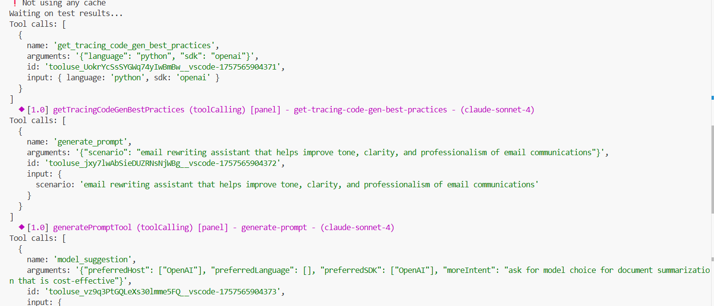

# AI Toolkit (AITK) Integration Guide

This document outlines how to integrate and test the VS Code Copilot Chat extension with the AI Toolkit.

## Prerequisites

- Node.js and npm installed (Node.js version 22.18.0 or higher is required. If you encounter crypto-related or other errors during simulation tests, ensure you're using Node.js 22.18.0+)
- Git access to both repositories
- GitHub OAuth token for authentication

## Setup Instructions

1. **Repository Setup**
   ```bash
   # Clone both repositories to the same parent directory
   git clone <copilot-chat-repo-url>
   git clone <skylight-repo-url>
   ```

2. **Install Dependencies**
   ```bash
   cd aitk-vscode-copilot-chat
   npm install
   ```

3. **Authentication Setup**
   Choose one of the following options:
   - Run `npm run get_token` to obtain a GitHub OAuth token interactively
   - Or set the `GITHUB_OAUTH_TOKEN` environment variable with your token

4. **Skylight Code Modifications**
   The following Skylight code modifications are automatically handled by the integration scripts:
   - Telemetry transmission is disabled in tool implementations
   - Template ZIP fetching is bypassed in `templateUtils.ts`

   The simulation scripts automatically set required environment variables:
   - `SIMULATION=1` - Enables simulation mode
   - `SKIP_TELEMETRY=1` - Disables telemetry transmission

5. **Build the Project**
   ```bash
   npm run build
   ```

## Testing

### Unit Tests
Run the basic unit test suite:
```bash
npm run simulate
```

### Example result


### End-to-End Tests
Run comprehensive e2e tests with model suggestions:
```bash
npm run simulate -- --external-scenarios <your-repo-path>/test/scenarios/test-generate-prompt  --parallelism 1 --sidebar --disable-tools=get_errors --verbose --output c:/temp/out --skip-cache --model claude-sonnet-4
```

## AI Toolkit Tool Integration

The repository includes an automated script for generating VS Code Copilot Chat tool wrappers for AI Toolkit (AITK) tools.

### Tool Generator Script (`generateAitkTool`)

The `generateAitkTool.ts` script automatically creates tool wrapper files that integrate AI Toolkit tools with VS Code Copilot Chat, including automatic extraction of real displayName and modelDescription values from the Skylight package files.

#### Usage

```bash
npm run generate-aitk-tool <referenceToolName> <importToolName> [generatedClassName]
```

#### Parameters

- **referenceToolName**: The reference tool name from Skylight package.json (e.g., "aitk-get_ai_model_guidance")
- **importToolName**: The exact name of the tool class to import from `ai-mlstudio/lmt`
- **generatedClassName**: Optional. The name for the generated wrapper class. If not provided, defaults to ImportToolName + "Wrapper"

#### Examples

```bash
# Generate tracing best practices tool with custom class name
npm run generate-aitk-tool aitk-get_tracing_code_gen_best_practices GetTracingCodeGenBestPracticesTool TracingCodeBestPracticesTool

# Generate model guidance tool with default class name (GetAiModelGuidanceToolWrapper)
npm run generate-aitk-tool aitk-get_ai_model_guidance GetAiModelGuidanceTool

# Generate prompt tool with custom class name
npm run generate-aitk-tool aitk-generate_prompt GeneratePromptTool PromptGeneratorTool

# Generate tracing page opener tool
npm run generate-aitk-tool aitk-open_tracing_page OpenTracingPageTool TracingPageTool
```

#### What the Script Does Automatically

1. **✅ Creates the tool wrapper file** in `/src/extension/tools/node/` with proper imports and structure
2. **✅ Updates allTools.ts** with the new import statement
3. **✅ Updates toolNames.ts** with both ToolName and ContributedToolName enum entries
4. **✅ Updates package.json** directly with the complete tool configuration
5. **✅ Extracts real values** from Skylight's package.json and package.nls.json:
   - Real displayName (e.g., "Get AI Model Guidance")
   - Real modelDescription with complete descriptions
   - Complete inputSchema with proper enum values and required fields

#### Manual Steps After Generation

The generator handles most integration steps automatically, but a few manual steps may remain:

1. **Review the generated configuration**: Check the package.json entry and adjust if needed
2. **Add localization entries**: If using localization, add display name entries to package.nls.json
3. **Test the integration**: Verify the tool works correctly in VS Code Copilot Chat
4. **Customize if needed**: Update the tool description and input schema to match specific requirements

#### Generated File Structure

The script creates tool files with this structure:

```typescript
export class GeneratedClassName implements ICopilotTool<void> {
	public static toolName = ToolName.GeneratedName;
	public static importToolName = new ImportToolName();

	async invoke(options: vscode.LanguageModelToolInvocationOptions<void>, token: vscode.CancellationToken) {
		const toolResult = await GeneratedClassName.importToolName.invoke(options as any, token);
		return new LanguageModelToolResult([
			new LanguageModelTextPart((toolResult.content[0] as any).value)
		]);
	}
}
```

#### Already integrated AITK Tools

| Reference Tool Name | Import Tool Name | Generated Class Name |
|-------------------|------------------|---------|
| `aitk-get_ai_model_guidance` | `GetAiModelGuidanceTool` | `ModelSuggestionTool` |
| `aitk-get_tracing_code_gen_best_practices` | `GetTracingCodeGenBestPracticesTool` | `TracingCodeBestPracticesTool` |
| `aitk-generate_prompt` | `GeneratePromptTool` | `CopilotGeneratePromptTool` |

### Test File Generator Script (`generate-stest`)

The `generateStestFile.ts` script automatically creates simulation test files for AI Toolkit tools with proper import management.

#### Usage

```bash
npm run generate-stest <toolName> [testQuestion]
```

#### Parameters

- **toolName**: The ToolName enum value (e.g., "GetTracingCodeGenBestPractices")
- **testQuestion**: Optional custom test question. If not provided, a default question is generated based on the tool name

#### Examples

```bash
# Generate test with default question
npm run generate-stest GetTracingCodeGenBestPractices

# Generate test with custom question
npm run generate-stest ModelSuggestion "Suggest me a good model for code generation"

# Generate test for tracing page tool
npm run generate-stest OpenTracingPage
```

#### What the Script Does Automatically

1. **✅ Creates the stest file** in `/test/e2e/` with kebab-case naming (e.g., `get-tracing-code-gen-best-practices.stest.ts`)
2. **✅ Adds import to simulationTests.ts** automatically with alphabetical ordering
3. **✅ Generates test structure** with proper suite and test configuration
4. **✅ Sets up tool configuration** with required tools enabled
5. **✅ Creates default questions** based on tool name if not provided

#### Generated Test Structure

The script creates test files with this structure:

```typescript
ssuite({ title: 'toolNameTool', subtitle: 'toolCalling', location: 'panel' }, () => {
	stest({ description: 'tool-name', model: "claude-sonnet-4" }, generateToolTestRunner({
		question: '/editAgent use the ToolName tool to help with my task?',
		expectedToolCalls: ToolName.ToolName,
		tools: {
			[ToolName.ToolName]: true,
			// ... other required tools
		},
	}));
});
```

#### Running Generated Tests

After generating a test file, you can run it with:

```bash
# Run all tests
npm run simulate
```

### Test Scenario Generator Script (`generate-test-scenario`)

The `generateTestScenario.ts` script automatically creates complete test scenario folders with conversation files, state files, and workspace structure similar to existing test scenarios.

#### Usage

```bash
npm run generate-test-scenario "<expectedToolCalls>" "<question>"
```

#### Parameters

- **expectedToolCalls**: The expected tool name in snake_case format (e.g., "generate_prompt")
- **question**: The test question that will be asked to the AI agent (e.g., "Generate a prompt good for summarizing documents?")

#### Examples

```bash
# Generate test scenario for prompt generation
npm run generate-test-scenario "generate_prompt" "Generate a prompt good for summarizing documents?"

# Generate test scenario for model suggestion
npm run generate-test-scenario "model_suggestion" "Suggest me a good model for code generation"

# Generate test scenario for tracing tools
npm run generate-test-scenario "get_tracing_code_gen_best_practices" "Get tracing code generation best practices?"
```

#### What the Script Does Automatically

1. **✅ Creates test scenario folder** in `/test/scenarios/test-{tool-name}/` with kebab-case naming
2. **✅ Generates conversation.json** with proper question formatting and tool configuration
3. **✅ Creates tools.state.json** with standard VS Code editor state for testing
4. **✅ Sets up workspace folder** with sample `functions.ts` file
5. **✅ Configures tool permissions** with common tools enabled plus the target tool

#### Generated Folder Structure

```
test/scenarios/test-{tool-name}/
├── {toolname}.conversation.json
├── tools.state.json
└── workspace/
    └── functions.ts
```

#### Generated Files Content

- **conversation.json**: Contains test question, expected tool calls, and tool permissions
- **tools.state.json**: Standard VS Code editor state with active file, selections, and diagnostics
- **workspace/functions.ts**: Sample TypeScript file with functions for testing context

#### Next Steps After Generation

1. **Review conversation.json**: Verify the question and tool configuration
2. **Customize workspace files**: Add relevant code files for your specific test scenario
3. **Run the test**: Use your simulation framework to execute the test scenario
4. **Iterate**: Adjust the test files based on test results and requirements
